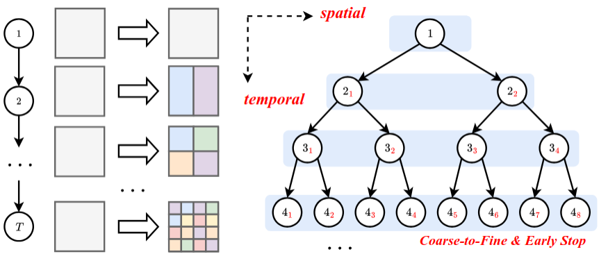
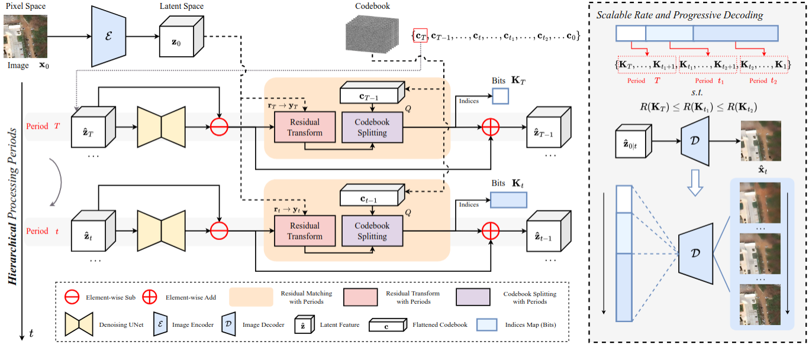

# [TGRS 2026] STHCD

Official implementation of the paper *[A Spatio-Temporal Hierarchical Diffusion Framework for Training-Free Perceptual Remote Sensing Image Compression][paper]*, published in **IEEE Transactions on Geoscience and Remote Sensing (TGRS 2026)**.

[paper]: https://ieeexplore.ieee.org/document/11447323

## Overview

Remote sensing imagery contains both large-scale structural information and fine-grained local texture. In diffusion-based compression, these components are not recovered uniformly: early denoising stages mainly reconstruct coarse, low-frequency structure, while later stages refine high-frequency details. The paper identifies this coarse-to-fine property as the core reason why uniform temporal codebook diffusion is inefficient for remote sensing compression.

STHCD addresses this mismatch by replacing uniform allocation with a hierarchical strategy over diffusion time, spatial granularity, and latent channels. Rather than treating all timesteps equally, it uses lighter allocation for structurally simple stages and concentrates more coding resources on detail-sensitive stages. This remains a training-free design: the framework works directly on top of a pretrained SD2.1 Base backbone without finetuning the diffusion model.

<p align="center">
  
</p>

*Motivation. Diffusion reconstruction is naturally coarse-to-fine. STHCD aligns resource allocation with this hierarchy instead of using the same coding strategy at every timestep.*

Following the paper, the public implementation is organized around three coupled components:

- `Spatial Residual Transformation`: adjusts spatial granularity through residual unshuffle operations
- `Channel-Wise Codebook Splitting`: controls rate allocation along latent channels without incurring exponential codebook growth
- `Time-Dependent Hierarchical Policy`: coordinates spatial and channel allocation across timesteps

Together, these components form a hierarchical latent compression pipeline. The input image is first mapped into latent space, residuals are then quantized under a time-varying policy, and the resulting bitstream supports final reconstruction as well as staged decoding.



*Framework. STHCD consists of latent initialization, hierarchical residual encoding, and scalable decoding. The runtime in this repository implements the same training-free spatio-temporal design described in the paper.*


## Environment Setup

Create the environment and install the runtime dependencies:

```bash
conda create -n sthcd python=3.9 -y
conda activate sthcd
pip install -r requirements.txt
```

## Run Test

### Baseline TCD Codec

Non-hierarchical reference configuration.

```bash
python scripts/run_visible.py \
  --mode codec \
  --image_dir "data/<remote_sensing_data_dir>" \
  --batch_size 16 \
  --num_timesteps 500 \
  --residual_factor 1 \
  --codebook_channel 4 \
  --local-files-only \
  --experiment_name readme_baseline_t500
```
----
### Spatial Hierarchy Codec

Paper spatial schedule at a lower bitrate.

```bash
python scripts/run_visible.py \
  --mode codec \
  --image_dir "data/<remote_sensing_data_dir>" \
  --batch_size 16 \
  --num_timesteps 50 \
  --residual_factor 1 \
  --codebook_channel 4 \
  --schedule_ref spatial \
  --local-files-only \
  --experiment_name readme_spatial_t50_f1_c4
```
----
### Channel Hierarchy Codec

Channel hierarchy with a larger residual factor.

```bash
python scripts/run_visible.py \
  --mode codec \
  --image_dir "data/<remote_sensing_data_dir>" \
  --batch_size 16 \
  --num_timesteps 125 \
  --residual_factor 2 \
  --codebook_channel 4 \
  --schedule_ref channel \
  --local-files-only \
  --experiment_name readme_channel_t125_f2_c4
```
----
### Full STHCD Codec

Main spatio-temporal configuration used by the paper.

```bash
python scripts/run_visible.py \
  --mode codec \
  --image_dir "data/<remote_sensing_data_dir>" \
  --batch_size 16 \
  --num_timesteps 64 \
  --residual_factor 1 \
  --codebook_channel 8 \
  --schedule_ref sthcd \
  --local-files-only \
  --experiment_name readme_sthcd_t64_f1_c8
```
----
### Encode Only

Writes `.bin` bitstreams without reconstruction.

```bash
python scripts/run_visible.py \
  --mode encode \
  --image_dir "data/<remote_sensing_data_dir>" \
  --batch_size 16 \
  --num_timesteps 64 \
  --residual_factor 1 \
  --codebook_channel 8 \
  --schedule_ref sthcd \
  --local-files-only \
  --experiment_name readme_sthcd_encode_t64
```
----
### Decode Only

Reconstructs from the bitstreams produced by the previous command.

```bash
python scripts/run_visible.py \
  --mode decode \
  --bin_dir outputs/results/visible/readme_sthcd_encode_t64/bins \
  --original_image_dir "data/<remote_sensing_data_dir>" \
  --batch_size 1 \
  --num_timesteps 64 \
  --residual_factor 1 \
  --codebook_channel 8 \
  --schedule_ref sthcd \
  --local-files-only \
  --experiment_name readme_sthcd_decode_t64
```

----
Each run writes into:

```text
outputs/results/visible/<experiment_name>/
```

Typical contents:

- `bins/` for saved bitstreams
- `reconstructions/` or `decoded/` for output images
- `reports/run_config.json`
- `reports/reconstruction_metrics.txt` or `reports/decode_metrics.txt`
- per-image CSV summaries in `reports/`

## Citation

If you find this code helpful, please kindly cite:

```bibtex
@article{cheng2026spatio,
    title={A Spatio-Temporal Hierarchical Diffusion Framework for Training-Free Perceptual Remote Sensing Image Compression},
    author={Cheng, Yangxuan and Meng, Fanyang and Qi, Hao and Shen, Han and Zhang, Zhongqiang and Wang, Ye and Liang, Yongsheng},
    journal={IEEE Transactions on Geoscience and Remote Sensing},
    year={2026},
    volume={64},
    number={},
    pages={1-17},
    publisher={IEEE},
    doi={10.1109/TGRS.2026.3675642}
}
```

## Acknowledgement
STHCD uses the pretrained Stable Diffusion 2.1-base weights for runtime inference. We thank the Stable Diffusion authors and the open-source community for making the SD 2.1-base model available.

This repository does not provide additional STHCD-specific training weights. Instead, it uses the official mirrored release of the Diffusers-format SD 2.1-base weights, currently configured as `SingularityCommLab/stable-diffusion-2-1-base`.

To download the SD 2.1-base weights, run:

```bash
python scripts/download_sd21.py
```

Please authenticate first with `hf auth login` or set `STHCD_HF_TOKEN` / `HF_TOKEN`. Make sure that your use of the SD 2.1-base weights complies with the corresponding upstream model license and usage terms.
